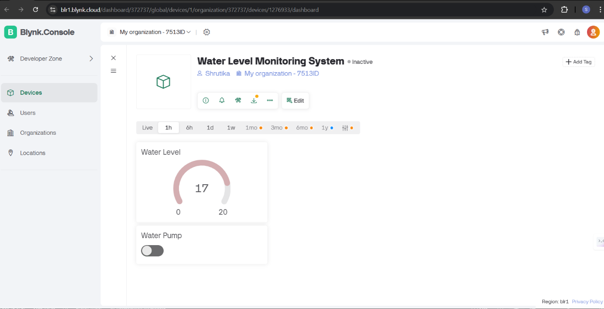
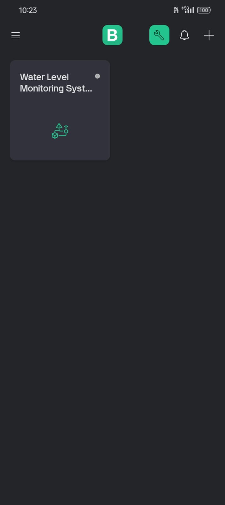
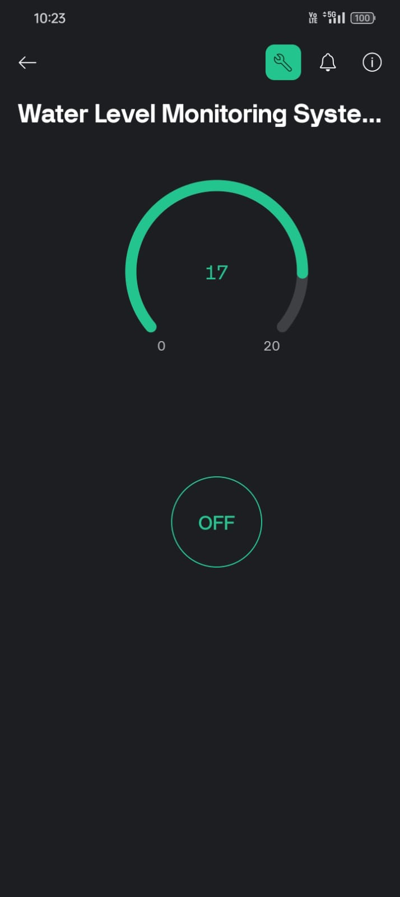

💧 Automated Water Consumption Monitoring System

An IoT-based smart system that monitors real-time water levels using an ESP8266 NodeMCU microcontroller, ultrasonic sensor, relay module, and the Blynk mobile app — promoting efficient water usage and conservation.

Show Image
Show Image
Show Image
Show Image
Show Image

🚀 Project Overview

Water scarcity is a growing global concern. Households, industries, and agricultural setups often waste water due to lack of real-time monitoring and manual intervention delays.

This project solves that by using IoT technology to:

Measure water levels in tanks using ultrasonic sensors
Automatically control water pumps via a relay module
Send real-time data to the Blynk cloud platform
Alert users on their mobile when water is low or overflowing
Enable remote monitoring and control from anywhere

🧠 Key Features

🏠 For Homeowners & Property Managers

Real-time water level display on mobile dashboard
Automatic pump ON/OFF based on water level
Push notifications for overflow or critically low levels
Historical usage tracking

🌾 For Agricultural Use

Optimized irrigation monitoring
Prevents over-watering and water waste
Remote control of pump systems

🤖 System Capabilities

Detects water level using ultrasonic sensor
Assigns visual indicators via 5 LEDs:

🔴 Critical Low
🟠 Low
🟡 Medium
🔵 High
🟢 Full

Displays level on LCD screen in real-time
Sends live data to Blynk cloud via Wi-Fi

🔄 System Workflow

Ultrasonic sensor continuously measures water level in the tank
ESP8266 NodeMCU processes sensor readings
Data is sent to Blynk Cloud via Wi-Fi
User views real-time level on Blynk mobile dashboard
If level is low → pump auto-starts via relay module
If level is full → pump auto-stops to prevent overflow
Push alerts sent to user's mobile for abnormal conditions

🏗️ Architecture

Ultrasonic Sensor (HC-SR04)
        ↓
ESP8266 NodeMCU (Microcontroller)
        ↓
Wi-Fi Module → Blynk Cloud Platform
        ↓
Mobile App Dashboard (Real-Time Monitoring)
        ↓
Relay Module → Water Pump (Auto Control)

🛠️ Technologies Used

🔹 Hardware

ESP8266 NodeMCU (Wi-Fi microcontroller)
Ultrasonic Sensor HC-SR04
Relay Module (230V AC pump control)
LCD Display (16x2 via I2C Module)
5x LEDs + 220Ω Resistors
230V AC Water Pump / Motor

🔹 Software & Platform

Arduino IDE (C++ programming)
Blynk App (mobile dashboard)
Blynk Cloud (data storage & transmission)

🔹 Communication Protocol

Wi-Fi (IEEE 802.11 b/g/n)
I2C (for LCD display)

📁 Repository Structure

Automated-Water-Consumption-Monitoring-System/
│
├── Water_level_system.ino       # Arduino source code
├── Circuit dig.webp             # Circuit diagram
├── automated_water_consumption_monitoring_sy...  # Project report PDF
└── README.md

▶️ How to Run the Project

1️⃣ Clone the Repository

bashgit clone https://github.com/shrutikahage2005/Automated-Water-Consumption-Monitoring-System.git
cd Automated-Water-Consumption-Monitoring-System

2️⃣ Hardware Setup

Connect Ultrasonic Sensor to ESP8266 NodeMCU (Trig → D6, Echo → D7)
Connect Relay Module to NodeMCU (IN → D1)
Connect LCD via I2C (SDA → D2, SCL → D3)
Connect 5 LEDs with 220Ω resistors to D0, D3, D4, D5, D8
Power the NodeMCU via USB or adapter

3️⃣ Blynk App Setup

Download Blynk app (iOS / Android)
Create a new project → Select ESP8266 as device
Copy the Auth Token sent to your email
Add widgets: Gauge (water level) + Button (pump control)

4️⃣ Upload Code

Open Water_level_system.ino in Arduino IDE
Replace AUTH_TOKEN, WIFI_SSID, and WIFI_PASSWORD with your values
Install libraries: Blynk, ESP8266WiFi, NewPing, LiquidCrystal_I2C
Select board: NodeMCU 1.0 (ESP-12E Module)
Upload the code → Open Serial Monitor to verify connection

📊 Results

ParameterOutcomeWater Level Detection AccuracyHigh ✅Data Transmission LatencyMinimal (real-time) ✅Pump Auto-ControlWorking ✅Mobile Alert SystemFunctional ✅Remote MonitoringEnabled via Blynk ✅

## 📸 Screenshots

### 🖥️ Blynk Web Dashboard
> Admin view showing water level gauge (at 17/20) and pump toggle switch.

---

### 📱 Blynk Mobile App — Device List
> Mobile home screen showing the Water Level Monitoring System device.

---

### 📱 Blynk Mobile App — Live Monitor
> Real-time water level gauge (17/20) with pump ON/OFF control button.

---

### ⚡ Circuit Diagram
> ESP8266 NodeMCU connected with ultrasonic sensor, relay module, LCD, and LEDs.

📱 Blynk Mobile App

Real-time water level displayed on mobile with pump ON/OFF control button.

💡 Opportunities & Future Scope

 AI/ML integration for predictive water usage analytics
 Multi-tank monitoring support
 Integration with smart home ecosystems (Alexa, Google Home)
 SMS/Email alerts for critical water levels
 Solar-powered system for remote agricultural use
 Blockchain-based data security for water usage logs
 City-level water distribution management

⚠️ Challenges Addressed

Sensor Accuracy — Ultrasonic sensor calibrated for precise level detection
Connectivity — Stable Wi-Fi ensured for uninterrupted cloud communication
Automation — Relay module eliminates manual pump operation
User Adoption — Simple Blynk interface requires no technical knowledge

🏫 Academic Details

Degree: B.Tech in Artificial Intelligence & Data Science
College: P. R. Pote Patil College of Engineering & Management, Amravati
Academic Year: 2024–25
Guide: Prof. S. D. Garle
HOD: A. B. Gadicha

👩‍💻 Team

Miss Shravani Javanjal And 
Miss Ishwari Kalpande  And 
Miss Anuradha Sagane   And
Miss Sonal Walivakar  And
Miss Shreyal Yeole

📜 References

Jesus Manuel Vargas-Cruz et al., "Water Consumption Monitoring System based on LOGO! 8.3 and AWS Cloud", IEEE, 2022
Sajith Saseendran, V. Nithya, "Automated water usage monitoring system", IEEE ICCSP, 2016
Aritra Ray, Shreemoyee Goswami, "IoT and Cloud Computing based Smart Water Metering System", 2020
Konstantinos Madias, Barbara Borusiak, "The role of knowledge about water consumption in IoT water metrics", 2022

📜 License

This project is for educational and academic purposes.

🙌 Acknowledgements

Special thanks to Prof. S. D. Garle (Guide) and Dr. A. B. Gadicha (HOD) for their continuous support and guidance throughout this project.

👩‍💻 Author

Shrutika Hage

GitHub: @shrutikahage2005
LinkedIn: shrutikahage2005

⭐ If you find this project useful, give it a star on GitHub!
